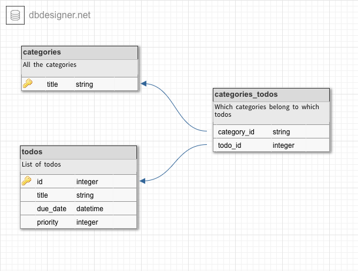

class: center, middle

# Generating SQL Queries in Haskell

#### Haskellerz Meetup
#### Zürich, May 19th 2016
.center[]
<br/>
##### By [Carlos D.](https://github.com/charlydagos)

---

# Agenda

1. Introduction
2. What this talk is about
3. Current state of things
4. Sample application and design
5. Haskell Relational Record (HRR)
6. Opaleye
7. Closing notes. Considerations.

---

## Introduction

.left-column[
#### About me
]

.right-column[
I'm Carlos!

I've been paid to write Java, Scala and PHP.

I've been kindly asked to write Ruby, Python, Clojure, Objective-C.

I'm in (newfound) love with Haskell.
]

---

## What this talk is about

#### Results oriented

We're concerned with results rather than performance.

#### Not about ORMs

Generating queries is not about mapping data types to database
rows.

#### PostgreSQL

The commonly-supported RDMBS between the libraries we'll be seeing is
PostgreSQL. Another one would be sqlite.red[\*], which is a simpler database
engine.

.footnote[.red.bold[\*] Although to use sqlite we'd have to download an
alternative version of Opaleye.]

---

## Sample application and design

We'll be looking at how to make an application that will allow me
to add TODOs, read them, and complete or discard them.

#### Sample output

We want to see all our TODOs

```bash
$ todos list
1. Buy food             (due by: tomorrow   )  (priority: 5 )
2. Call parents         (due by: tomorrow   )  (priority: 7 )
3. Wash clothes         (due by: 23 May 2016)  (priority: - )
4. Finish presentation  (due by: today      )  (priority: 10)
5. Call boss            (due by: 18 May 2016)  (priority: 20)
```

We want to find specific ones

```bash
$ todos find 1
Todo:       Buy food
Due by:     Tomorrow
Priority:   5
Categories: #independence #responsible
```
---

## Sample application and design

#### Sample output

We want to complete a TODO

```bash
$ todos complete 4
👍🏼 Completed 'Finish presentation #haskellerz'
```

Of course we also want to add a TODO

```bash
$ todos add 'Display presentation at Haskellerz!' \
            --categories 'haskellerz, fun'        \
            --priority 10
Added TODO with id 6
```

So far this is a basic CRUD. But what about more complex queries? No software
is complete without its flags. Plus, from `find` we saw that our app is aware
of the concept of a "category", as well as due dates.

---

## Sample application and design

#### Sample output

List TODOs that are due by a certain date.

```bash
$ todos list --due-by tomorrow --with-categories
1. Buy food     (due by: tomorrow) (priority: 5) #independence #responsible
2. Call parents (due by: tomorrow) (priority: 7) #good-son
```

List TODOs that are due on a certain date, and belong to a certain category.

```bash
$ todos list --due-by tomorrow --order-by-priority --categories "responsible"
2. Call parents (due by: tomorrow) (priority: 7) #good-son
1. Buy food     (due by: tomorrow) (priority: 5) #independence #responsible
```

List TODOs that are already late...

```bash
$ todos list --late --with-categories
5. Call boss (due by: 18 May 2016) (priority: 20) #good-employee
```

---

## Sample application and design

#### Database design

.pull-left[
<br>

]

.pull-right[
```sql
create table todos(
  id serial primary key,
  title varchar(50) not null,
  due_date datetime not null,
  prio int
)

create table categories(
  title varvar(50) not null
)

create table categories_todos(
  category_id int not null,
  todo_id int not null,
  primary key (category_id, todo_id)
)
```
]

---

## Sample application and design

#### Queries we'll need

List our TODOs
```sql
select * from todos
```
Find a specific TODO
```sql
select * from todos where id = ?
```
Complete a TODO
```sql
delete from todos where id = ?
```
List TODOs that are due by a specific date
```sql
select * from todos where due_date = ?
```
---

## Sample application and design

#### Queries we'll need

List late TODOs
```sql
select * from todos where due_date < current_date
```
List TODOs due on a specific date and belonging to a certain category
```sql
select * from categories c
left join categories_todos ct on c.title = ct.category_title
left join todos t             on t.id = ct.todo_id
where c.title    = ?
and   t.due_date = ?
```

---

## Current state of things

---

## Haskell Relational Record (HRR)

---

## Opaleye

---

## Closing Notes & Considerations
