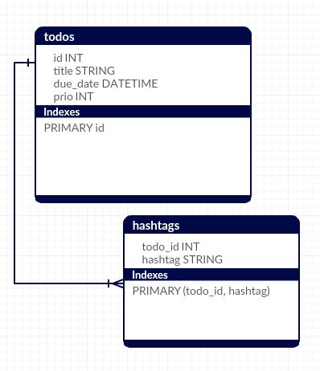

class: center, middle

# Generating SQL Queries in Haskell

#### Haskellerz Meetup
#### Zürich, May 19th 2016
.center[]
<br/>
##### By [Carlos D.](https://github.com/charlydagos)

---

# Agenda

1. Introduction
2. What this talk is about
3. Sample application and design
4. Current state of things
5. Haskell Relational Record (HRR)
6. Opaleye
7. Closing notes. Considerations.

---

## Introduction

.left-column[
#### About me
]

.right-column[
I'm Carlos.

I've been paid to write Java, Scala and PHP.

I've been kindly asked to write Ruby, Python, Clojure, Objective-C.

I'm in (newfound) love with Haskell.
]

---

## What this talk is about

#### Results oriented

We're concerned with results rather than performance.

#### Not about ORMs

Generating queries is not about mapping data types to database rows.

#### PostgreSQL

The commonly-supported RDMBS between the libraries we'll be seeing is
PostgreSQL. Another one would be sqlite.red[\*], which is a simpler database
engine.

.footnote[.red.bold[\*] Although to use sqlite we'd have to download an
alternative version of Opaleye.]

---

## Sample application and design

We'll be looking at how to make an application that will allow me
to add TODOs, read them, and complete or discard them.

#### Sample output

We want to see all our TODOs

```bash
$ todos list
1. Buy food            (due by: 2016-05-20) (priority: 5 )
2. Call parents        (due by: 2016-05-20) (priority: 7 )
3. Wash clothes        (due by: 2016-05-23) (priority: - )
4. Finish presentation (due by: 2016-05-19) (priority: 10)
5. Call boss           (due by: 2016-05-18) (priority: 20)
```

We want to find specific ones

```bash
$ todos find 1
Todo:     Buy food
Due by:   2016-05-20
Priority: 5
Hashtags: #independence #responsible
```
---

## Sample application and design

#### Sample output

We want to complete a TODO

```bash
$ todos complete 4
👍🏼 Completed 'Finish presentation #haskellerz'
```

Of course we also want to add a TODO

```bash
$ todos add 'Display presentation at Haskellerz!' \
            --due-by   '2016-05-19'               \
            --hashtags '#haskellerz, #fun'        \
            --priority 10
Added TODO with id 6
```

So far this is a basic CR~~U~~D. But what about more complex queries? No software
is complete without its flags. Plus, from `$ todos find 1` we saw that our app is aware
of the concept of a "hashtag", as well as due dates.

---

## Sample application and design

#### Sample output

List TODOs that are due by a certain date.

```bash
$ todos list --due-by '2016-05-20' --with-hashtags
1. Buy food     (due by: 2016-05-20) (priority: 5) #independence #responsible
2. Call parents (due by: 2016-05-20) (priority: 7) #good-son
```

List TODOs that are due on a certain date, and belong to a certain hashtag.

```bash
$ todos list --due-by '2015-05-20' --order-by-priority --hashtag "#responsible"
2. Call parents (due by: 2015-05-20) (priority: 7) #good-son
1. Buy food     (due by: 2015-05-20) (priority: 5) #independence #responsible
```

List TODOs that are already late...

```bash
$ todos list --late --with-hashtags
5. Call boss (due by: 18 May 2016) (priority: 20) #good-employee
```

---

## Sample application and design

#### Database design

.pull-left[
<br>

]

.pull-right[
```sql
create table todos(
  id serial primary key,
  title varchar(50) not null,
  due_date date not null,
  prio int
)

create table hashtags(
  hashtag varchar(50) not null,
  todo_id int not null,
  primary key (hashtag, todo_id)
)
```
]

---

## Sample application and design

#### Quick refresher on JOINS

.center[]

---

## Sample application and design

#### (Some of the queries we'll need

To see all our TODOs
```sql
select * from todos
```
To find a specific TODO
```sql
select * from todos where id = ?
```
To complete a TODO
```sql
delete from todos where id = ?
```
To add a TODO
```sql
insert into todos (title, due_date, prority) values (?, ?, ?)
```
---

## Sample application and design

#### Database design

List TODOs that are due by a specific date
```sql
select * from todos where due_date = ?
```
List TODOs ordered by priority
```sql
select * from todos order by prio
```
List late TODOs
```sql
select * from todos where due_date < current_date
```
List TODOs due on a specific date and belonging to a certain hashtag
```sql
select * from hashtags h
join todos t on h.todo_id = t.id
where h.hashtag  = ?
and   t.due_date = ?
```

---

## Sample application and design

In short, we'll plenty of queries to match all the possible combinations of flags that I can accept.

- I can compose flags
- Can I compose my queries?

---

## Current state of things

#### Leon Smith's [`postgresql-simple`](http://hackage.haskell.org/package/postgresql-simple)

I can design my types normally

```haskell
-- file simple/src/Simple/Todo.hs
data Todo = Todo { getId       :: !(Maybe Int) -- Can be null
                 , getTitle    :: !String      -- Title of the todo
                 , getDueDate  :: !Date        -- Date of the todo
                 , getPrio     :: !(Maybe Int) -- Priority of the todo
                 } deriving (Show)

-- file simple/src/Simple/Hashtag.hs
data Hashtag = Hashtag { getTodoId  :: !(Maybe Int) -- Can be null
                       , getHashtag :: !String      -- Hashtag string val
                       } deriving (Show, Eq)
```

---

## Current state of things

Define how each row maps to the declared data

```haskell
-- file simple/src/Simple/Todo.hs
instance FromRow Todo where
    fromRow = Todo <$> field -- id
                   <*> field -- title
                   <*> field -- due date
                   <*> field -- prio

instance ToRow Todo where
    toRow t = [ toField (getTitle t)
              , toField (getDueDate t)
              , toField (getPrio t)
              ]

-- file simple/src/Simple/Hashtag.hs
instance FromRow Hashtag where
    fromRow = Hashtag <$> field -- the todo id
                      <*> field -- the hashtag string

instance ToRow Hashtag where
    toRow h = [ toField . fromJust . getTodoId $ h
              , toField . getHashtag $ h
              ]
```

---

## Current state of things

#### Sample methods

```haskell
-- file src/Simple/Todo.hs
allTodos :: Connection -> IO [Todo]
allTodos conn = query_ conn q
                where
                  q = [sql| select id, title, due_date, prio
                            from todos |]

-- Same query, with 1 restriction
findTodo :: Connection -> Int -> IO (Maybe Todo)
findTodo conn tid = do
               result <- query conn q (Only tid)
               return $ if length result == 1 then
                    Just (head result)
               else
                    Nothing
               where
                 q = [sql| select id, title, due_date, prio
                           from todos
                           where id = ? |]
```

That was simple enough!

---

## Current state of things

However...

```haskell
-- Same query again, this time sorted in a specific way
allTodosByPrio :: Connection -> IO [Todo]
allTodosByPrio conn = query_ conn q
                      where
                        q = [sql| select id, title, due_date, prio
                                  from todos
                                  order by prio desc
                                  nulls last |]

-- Same query as before, this time with another restriction
allLateTodos :: Connection -> IO [Todo]
allLateTodos conn = query_ conn q
                    where
                      q = [sql| select id, title, due_date, prio
                                from todos
                                where due_date < current_date |]

```

What's the problem?

---

## Current state of things

Although `postgresql-simple` is amazing, let's look at a few issues we
wish we could address:

#### Problems

- I'm repeating myself constantly.
- My queries are almost always the same, varying in by restriction, or order
specification.
- "QuasiQuoted" strings are hard to concatenate... but do we really want
ease of concatenation? **NO!** `sql`-QuasiQuotes are hard to concatenate on
purpose!
- My `FromRow` and `ToRow` instances will be constantly in need of updates
as the requirements change.
- `field` functions provide a convenient row parser, however the result is not
very semantically-meaningful.
- I could write an query in a quasiquote and not know that anything is wrong
until I run it.
- I have no guarantee that I'm typing a type-safe query (i.e. The `getDate`
from `Todo` could be a `String`, and my program would compile, but it would
not crash until I run it, since the field in the table is defined as a `date`.
This is also a problem when refactoring my database.

---

## Current state of things

Case in point:

```haskell
-- file simple/src/Simple/BadTodo.hs
data BadTodo = BadTodo !(Maybe Int) -- Can be null
                       !String      -- Title of the todo
                       !String      -- Date of the todo, this time as a String
                       !(Maybe Int) -- Priority of the todo
                       deriving (Show)

let getBadTodos = do {
    c <- connect defaultConnectionInfo
    badTodos <- allBadTodos -- Todos with a date type as String
}

getBadTodos

*** Exception: Incompatible {
    errSQLType = "date",
    errSQLTableOid = Just (Oid 16401),
    errSQLField = "due_date",
    errHaskellType = "Text",
    errMessage = "types incompatible"
}
```

---

## Haskell Relational Record (HRR)

#### My new definition for `Todo`

```haskell
-- file hrr/src/HRR/Todo.hs
{-# LANGUAGE TemplateHaskell #-}
```
```haskell
import HRR.DataSource

$(defineTable "public" "todo" [''Show])
```

#### What happened?

- HRR will use TH to generate our data declaration
- A database connection will be needed on compilation time
- Our data declartion will have the fields of the table in CamelCase
- I did have to define the `defineTable` method, see file
`hrr/src/HRR/DataSource.hs`, with PostgreSQL-specific functions.
- Some "queries" will be generated for me already, namely: `todo`, `insertTodo`,
`selectTodo`, `updateTodo`, ...

---

## Haskell Relational Record (HRR)

#### Important Operators

- `!`
- `><`
- `.<.`, `.>.`, `.>=.`, `.<=.`, `.=.`

#### Important data structures

- `Pi p a`
- `Relation p a`
- `Projection c a`
- `Query`, `InsertQuery`, `Update`...

### Important Functions

- `just`
- `wheres`
- `on`
- `groupBy`
- `in`
- `or`
- `asc`, `desc`

---

## Opaleye

---

## Closing Notes & Considerations

#### Note on HaskellDB

[As expressed by HRR creators](http://khibino.github.io/haskell-relational-record/pdf/hrr-haskell-sympo2015-rejected.pdf),
HaskellDB has a number of drawbacks.

Mainly:

- Limited expression ability of projections.
- Does not provide support for (left, right, or full) outer joins
- Column name conflicts.
- Partial support for placeholders.
- Unclear aggregation semantics.

---

## Closing Notes & Considerations

#### Reading material

- [Oliver Charles on `postgresql-simple` at ZuriHac 2015](https://youtu.be/GobPiGL9jJ4?t=17m30s)
- [HRR on Haskell Hackathon, December 2012](http://htmlpreview.github.io/?https://github.com/khibino/haskell-relational-record/blob/master/doc/slide/haskell-hackathon-201412/HRR.html)
- [Experience Report on HRR](http://khibino.github.io/haskell-relational-record/pdf/hrr-haskell-sympo2015-rejected.pdf)
- [Reddit thread with opinions on Opaleye and HRR - With creators' comments](https://www.reddit.com/r/haskell/comments/3fuq4s/opaleye_or_relationalrecord/)
